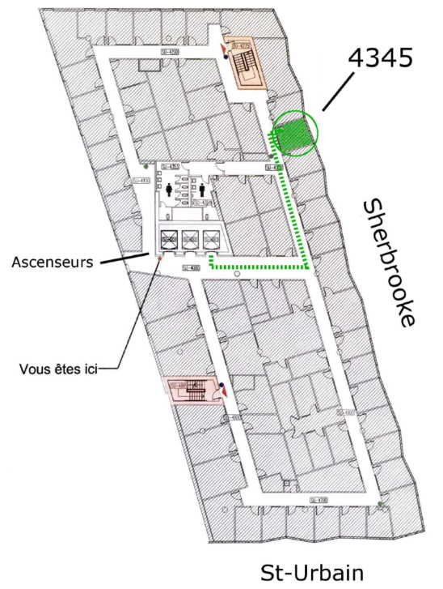

---
# An instance of the Contact widget.
# Documentation: https://wowchemy.com/docs/page-builder/
widget: contact

# This file represents a page section.
headless: false

# Order that this section appears on the page.
weight: 10

title: Contact
subtitle:

content:
  # Contact (edit or remove options as required)

  email: theriault.remi at courrier.uqam.ca
  phone: Four-Three-Eight 995 7648
  address:
    street: 100, rue Sherbrooke Ouest
    city: Montréal
    region: Québec
    postcode: 'H2X 3P2'
    country: Canada
    country_code: CA
  coordinates:
    latitude: '45.510838'
    longitude: '-73.569965'
  directions: Office 4345 (4th floor), Pavillon Adrien Pinard. Take the elevator to the 4th floor, turn left, left again, my office will be to your right.
  office_hours:
    - 'Monday-Friday 10:00 to 18:00'
    # - 'Wednesday 09:00 to 10:00'
  # appointment_url: 'https://calendly.com'
  #contact_links:
  #  - icon: comments
  #    icon_pack: fas
  #    name: Discuss on Forum
  #    link: 'https://discourse.gohugo.io'

  # Automatically link email and phone or display as text?
  autolink: true

  # Email form provider
  form:
    provider: netlify
    formspree:
      id:
    netlify:
      # Enable CAPTCHA challenge to reduce spam?
      captcha: false

design:
  columns: '2'
---

> I respectfully acknowledge that UQAM is located on unceded Indigenous lands. The Kanien’kehá:ka Nation is recognized as the custodians of these lands and waters. Tiohtià:ke/Montréal is historically known as a gathering place for many First Nations. Today, it is home to a diverse population of Indigenous and other peoples. I respect the continued connections with the past, present and future in our ongoing relationships with Indigenous and other peoples within the Montreal community.
> 
> This Territorial Acknowledgement and resources were created by Concordia University’s Indigenous Directions Leadership Group (2017). To read the entire Territorial Acknowledgement and learn more about why it was written this way, please visit www.concordia.ca/indigenous/resources/territorial-acknowledgement.html.
